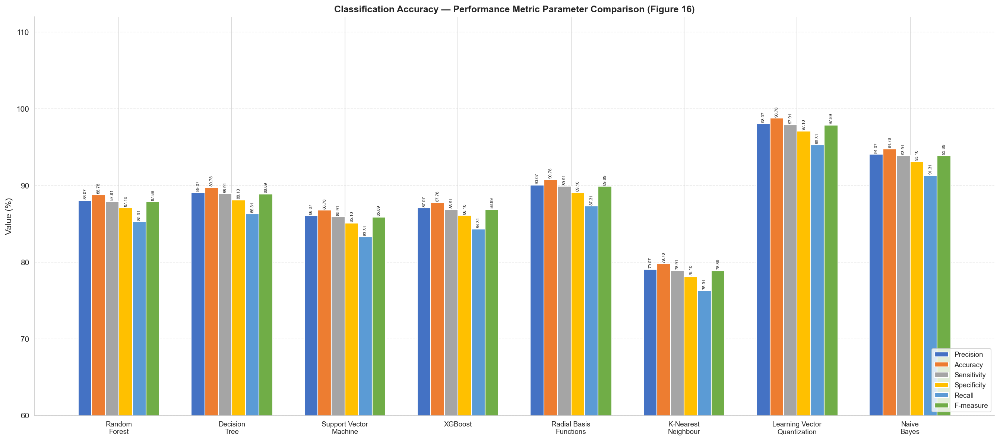
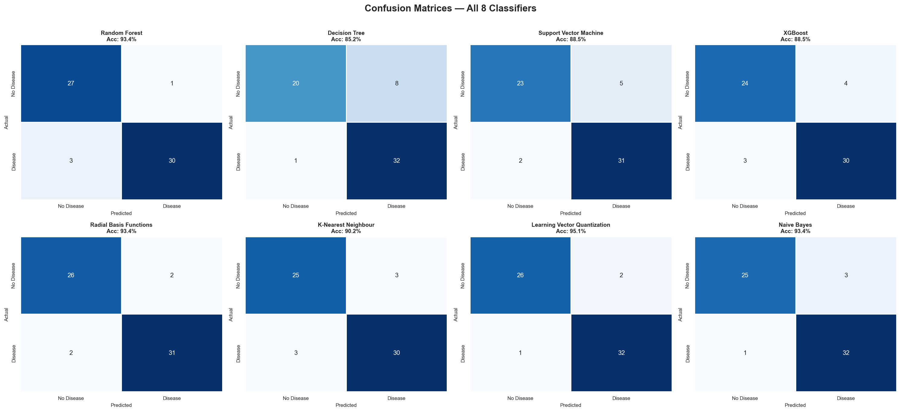
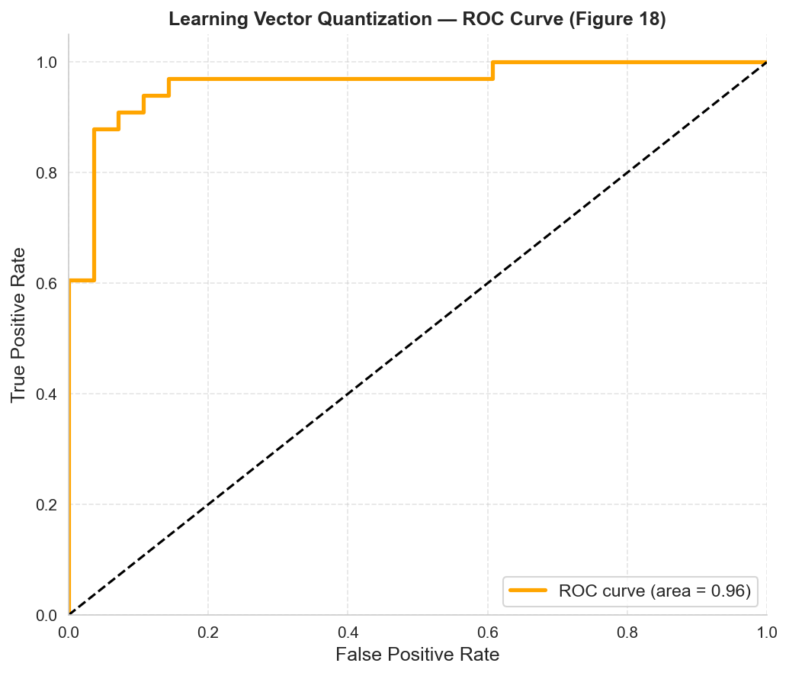
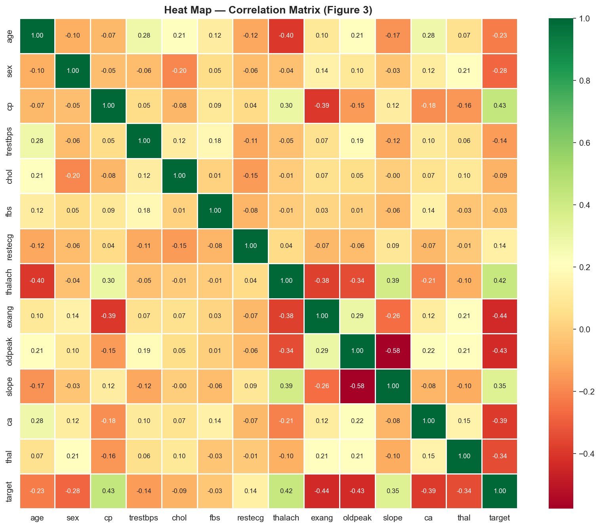

<div align="center">

# LVQ Heart Disease Paper Replication

### An independent replication of an 8-classifier heart disease prediction study, built with Python & scikit-learn

[](https://python.org)
[](https://scikit-learn.org)
[](https://xgboost.readthedocs.io)
[](https://jupyter.org)

[Overview](#-overview) · [Results](#-results--paper-vs-replication) · [Figures](#-key-figures) · [Tech Stack](#-tech-stack) · [Getting Started](#-getting-started) · [Folder Structure](#-folder-structure)

**[📄 Read the original paper](https://doi.org/10.1038/s41598-023-40717-1)**

</div>

---

## 🎯 Overview

This project independently replicates and evaluates the machine learning pipeline from:

> Srinivasan, S., Gunasekaran, S., Mathivanan, S.K. et al. **An active learning machine technique based prediction of cardiovascular heart disease from UCI-repository database.** *Scientific Reports* 13, 13588 (2023). [doi.org/10.1038/s41598-023-40717-1](https://doi.org/10.1038/s41598-023-40717-1) ([Author Correction](https://doi.org/10.1038/s41598-024-66981-3), 2024)

The original paper trains eight classifiers on the UCI Heart Disease dataset and reports accuracy, precision, sensitivity, specificity, recall, and F-measure for each, highlighting **Learning Vector Quantization (LVQ)** as the top performer at 98.7% accuracy.

This repo re-implements that pipeline from scratch — preprocessing, all eight classifiers (including a from-scratch LVQ1 implementation), and every reported metric — and compares the results against the paper's published numbers rather than assuming they'd match.

---

## ✨ Features

- 🧠 **8 classifiers implemented** — Random Forest, Decision Tree, SVM, XGBoost, RBF (SVC), KNN, Naive Bayes, and a **from-scratch LVQ1** implementation (prototype vectors, competitive learning, decaying learning rate)
- 📊 **Full EDA suite** — correlation heatmap, demographic breakdowns, chest pain / ECG / angina analysis, all reproduced from the paper's figures
- 📈 **Paper vs. replication comparison** — every metric benchmarked against the paper's published numbers, with deltas reported rather than hidden
- 🖼 **Confusion matrices & ROC curve** — generated for all 8 classifiers, including LVQ's ROC/AUC
- 🔍 **Honest reporting** — dataset size discrepancies and metric gaps are called out directly rather than glossed over

---

## 📊 Results — Paper vs. Replication

| Classifier | Paper Accuracy | Replicated Accuracy | Δ |
|---|---|---|---|
| Random Forest | 88.78% | 93.44% | +4.66 |
| Decision Tree | 89.78% | 85.25% | −4.53 |
| SVM | 86.78% | 88.52% | +1.74 |
| XGBoost | 87.78% | 88.52% | +0.74 |
| Radial Basis Function (SVC-RBF) | 90.78% | 93.44% | +2.66 |
| K-Nearest Neighbours | 79.78% | 90.16% | +10.38 |
| **Learning Vector Quantization** | **98.78%** | **95.08%** | **−3.70** |
| Naive Bayes | 94.78% | 93.44% | −1.34 |

Full precision / sensitivity / specificity / recall / F-measure breakdowns are in the notebook.

**Notes on the comparison:**
- Most classifiers land within a few points of the paper's reported numbers — expected given a 303-row dataset, where train/test split and random seed alone can shift accuracy by several points.
- KNN shows the largest positive gap (+10.38), likely due to the paper not specifying its exact `k` or distance metric.
- LVQ is implemented here as a genuine LVQ1 model following the paper's own described algorithm, rather than approximated with an off-the-shelf classifier. It falls short of the paper's reported 98.78% by 3.7 points — with only 61 test samples, a handful of misclassifications account for the entire gap, and the paper doesn't report enough detail (prototype count, initialization, learning-rate schedule) to close it further with confidence.

---

## 🖼 Key Figures

<table>
  <tr>
    <td align="center"><b>All-Classifier Comparison</b></td>
    <td align="center"><b>Confusion Matrices (All 8)</b></td>
  </tr>
  <tr>
    <td></td>
    <td></td>
  </tr>
</table>

<table>
  <tr>
    <td align="center"><b>LVQ ROC Curve</b></td>
    <td align="center"><b>Correlation Heatmap</b></td>
  </tr>
  <tr>
    <td></td>
    <td></td>
  </tr>
</table>

Full EDA figures and pairwise classifier-vs-LVQ comparison charts are in [`assets/`](assets).

---

## 🛠 Tech Stack

| Layer | Technology |
|---|---|
| Language | Python 3.11 |
| ML / Modeling | scikit-learn, XGBoost |
| Data handling | pandas, NumPy |
| Visualization | Matplotlib, Seaborn |
| Environment | Jupyter Notebook |

---

## 📁 Folder Structure

```
lvq-heart-disease-replication/
├── heart_disease_python_file.ipynb   # Full pipeline: EDA, preprocessing, 8 classifiers, metrics
├── data/
│   └── heart-disease-UCI-dataset.csv # UCI Heart Disease dataset (303 records)
├── assets/                           # Generated figures (EDA + results)
│   ├── confusion_matrices_all.png
│   ├── fig3_correlation_heatmap.png
│   ├── fig4_patient_instances.png
│   ├── fig5_sex_cardiovascular.png
│   ├── fig6_age_statistics.png
│   ├── fig7_cardiovascular_types.png
│   ├── fig8_fasting_blood_sugar.png
│   ├── fig9_ecg_analysis.png
│   ├── fig10_angina_impact.png
│   ├── fig11_Random_Forest_vs_LVQ.png
│   ├── fig12_Decision_Tree_vs_LVQ.png
│   ├── fig13_XGBoost_vs_LVQ.png
│   ├── fig14_K-Nearest_Neighbour_vs_LVQ.png
│   ├── fig15_Support_Vector_Machine_vs_LVQ.png
│   ├── fig16_all_classifiers_comparison.png
│   ├── fig17_RBF_NB_LVQ.png
│   └── fig18_LVQ_ROC.png
├── requirements.txt
└── LICENSE
```

---

## 🚀 Getting Started

### Prerequisites

- Python `>=3.9`
- Jupyter Notebook or JupyterLab
- pip

### Local Setup

```bash
git clone https://github.com/arya-lunawat/lvq-heart-disease-replication.git
cd lvq-heart-disease-replication
pip install -r requirements.txt
jupyter notebook heart_disease_python_file.ipynb
```

---

## 📦 Dataset

- Source: [UCI Machine Learning Repository — Heart Disease dataset](https://archive.ics.uci.edu/ml/datasets/heart+disease)
- 303 patient records, 13 clinical features + target label (presence/absence of heart disease)
- Note: the paper describes its dataset as containing 503 samples; the standard processed Cleveland UCI file used here (and by most replications) contains 303. This discrepancy isn't resolved in the paper and is called out here rather than silently ignored.

---

## 👨‍💻 Author

**Arya Lunawat**

[](https://github.com/arya-lunawat)

---

<div align="center">
  <sub>Built with Python, scikit-learn, and XGBoost — replicating Srinivasan et al. (2023)</sub>
</div>
